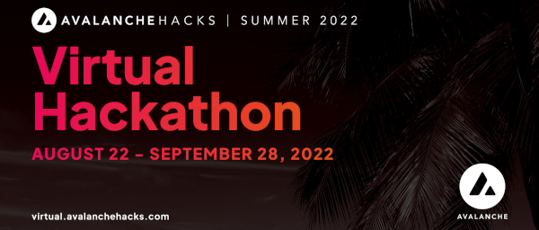
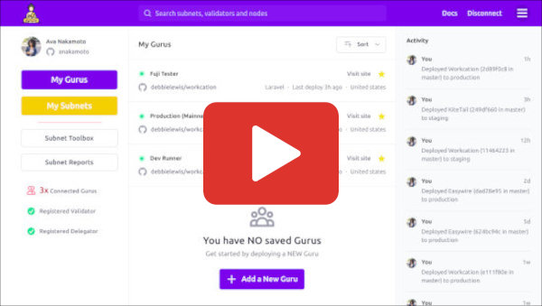

# Avalanche Hacks | Summer 2022

[](https://virtual.avalanchehacks.com)


## Introduction

Subnet Guru is a remote node assistant, built for the sole purpose of making Subnet management effortless from A to Z.

[](https://subnet.guru/demo.mp4)

( [Click here to play a 3-minute MP4 demo video](https://subnet.guru/demo.mp4) )


## Project Goals

Our team aims to both simplify and expand availability for one of the MOST in-demand products in the entire space, [__Avalanche Subnets__](https://docs.avax.network/subnets).

We aim to to build and deploy a working __Minimum Viable Product__ for an all-NEW virtual assistant, specifically designed to make building and deploying an Avalanche Subnet an effortless experience.

### TOP3 Benefits of Subnet Guru are:

1. A [__genesis file__](https://docs.avax.network/community/tutorials-contest/2022/avax-subnet-customization#creating-a-custom-genesis-file) creation wizard.
2. A virtual private server (VPS) assistant.
3. A comprehensive monitoring dashboard.

### But there's sooo much more... Let's get started! 👇

## 1-2-3 Installation & Setup

Getting started couldn't possibly be any easier. __Subnet Validators__ simply run the following command from their local or remote node(s) to download the Guru and begin the installation process:

> __PLEASE NOTE!__ Subnet Guru is currently __ONLY__ available for __Debian__ & __Ubuntu__ systems.  
Windows and Mac are coming soon...

### Run Subnet Guru

```sh
curl -sSf https://run.subnet.guru | sh
```

### Install Subnet Guru

```sh
# Download Guru
curl -sSf https://install.subnet.guru -o guru

# Setup Guru
chmod +x guru

# Install Guru
sudo mv guru /usr/local/bin/

# Launch Guru
guru
```
_( __Did you know? —__ Subnet Guru is a FOSS [__Rust__](https://www.rust-lang.org/) application )_


### _Guru introduces a total solution for Fi+ teams to Design, Build, Test, Deploy and Manage their bespoke Avalanche Subnets._

## Design

_TBD_

## Build

_TBD_

## Test

_TBD_

## Deploy

_TBD_

## Manage

_TBD_

## Free and Open Source Software _(FOSS)_

Naturally, we've built every aspect of this application to be 100% open-source.

We welcome the judges to review our [__GitHub repo__](https://github.com/avasdao/subnet-guru) for a deeper dive into how Subnet Guru was built. But if you're just looking for the __TL;DR,__ then here are the technical highlights:

- Gurus are built using [__Rust__](https://www.rust-lang.org/)
- All communications are handled using [__libp2p__](https://libp2p.io/)
- Web portal _(front-end)_ is hosted using [__IPFS__](https://ipfs.io/)

### Built with Rust


This was actually the first-time our team has built a Rust application. The experience was pure joy!

### Libp2p Communications

It was of critical importance to us that the communication be as decentralized as possible. We would accept any single point of failure when it comes to managing production Subnets.

### IPFS Web Portal Hosting

Security is our first thought and our last thought. IPFS allows us to eliminate ANY possibility of a hacker _(or rogue actor)_ compromising the single point of access to our Guru Portal.

Our primary web portal [__https://subnet.guru__](https://subnet.guru) is powered by [__Cloudflare's Web3 Gateway__](https://www.cloudflare.com/web3/) using [__DNSLink__](https://developers.cloudflare.com/web3/ipfs-gateway/concepts/dnslink/).


## What's Next?

Subnet Guru is part of a larger Avalanche Subnet effort called __Subnet Builders ([https://subnet.builders](https://subnet.builders)).__ Our team will continue developing Guru while we work to complete our MVP for Builders.

__On our Roadmap for the remainder of 2022 is to:__

1. Automate the deployment process with CI/CD.
2. Add an Access Control List (ACL) via smart contract.
