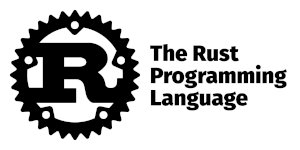

# Avalanche Hacks | Summer 2022


## Introduction

Subnet Guru is a remote node assistant, built for the sole purpose of making Subnet management effortless from A to Z.


## Project Goals

We aim to to build and deploy a working __Minimum Viable Product__ for an all-NEW virtual assistant, specifically designed to make building and deploying an Avalanche Subnet an effortless experience.

## 1-2-3 Installation & Setup

Getting started couldn't be ANY easier. __Subnet Validators__ simply run the following command from their local or remote node(s) to download the Guru and begin the installation process:

```sh
curl -sSf https://setup.subnet.guru | sh
```
_( __Did you know? —__ Subnet Guru is a FOSS [__Rust__](https://www.rust-lang.org/) application )_


## Free and Open Source Software _(FOSS)_

Naturally, we've built every aspect of this application to be 100% open-source.

We welcome the judges to review our [__GitHub repo__](https://github.com/avasdao/subnet-guru) for a deeper dive into how Subnet Guru was built. But if you're just looking for the __TL;DR,__ then here are the technical highlights:

- Gurus are built using [__Rust__](https://www.rust-lang.org/)
- All communications are handled using [__libp2p__](https://libp2p.io/)
- Web portal _(front-end)_ is hosted using [__IPFS__](https://ipfs.io/)

### Built with Rust



This was actually the first-time our team has built a Rust application. The experience was pure joy!

### Libp2p Communications

It was of critical importance to us that the communication be as decentralized as possible. We would accept any single point of failure when it comes to managing production Subnets.

### IPFS Web Portal Hosting

Security is our first thought and our last thought. IPFS allows us to eliminate ANY possibility of a hacker _(or rogue actor)_ compromising the single point of access to our Guru Portal.

Our primary web portal [__https://subnet.guru__](https://subnet.guru) is powered by [__Cloudflare's Web3 Gateway__](https://www.cloudflare.com/web3/) using [__DNSLink__](https://developers.cloudflare.com/web3/ipfs-gateway/concepts/dnslink/).
